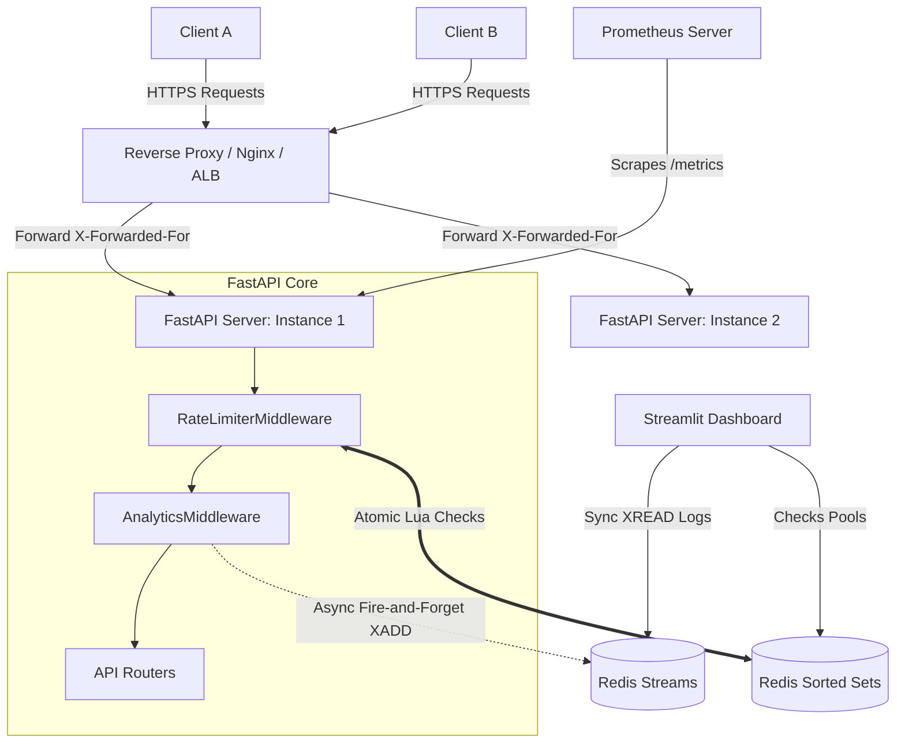

# System Architecture Diagrams

This document contains visual diagrams describing the Distributed API Rate Limiter & Traffic Analyzer using Mermaid syntax.

---

## 1. System Architecture Diagram

This diagram displays the flow of client requests through the reverse proxy, API gate, database cache, and observability dashboards.



---

## 2. Request Sequence Diagram

The sequence diagram demonstrates how a client request is handled: checking rate limits atomically in Redis, returning headers, and logging to the stream asynchronously.

```mermaid
sequence_order client, middleware, redis, router, stream

sequenceDiagram
    autonumber
    actor Client
    participant Middleware as RateLimiter & Analytics Middleware
    participant Redis as Redis Server (Sorted Sets)
    participant Router as API Route Controller
    participant Stream as Redis Stream (analytics)

    Client->>Middleware: HTTP GET /api/v1/orders
    Note over Middleware: Extract Client IP from X-Forwarded-For<br/>Generate unique X-Request-ID
    
    rect rgb(20, 30, 40)
        Note over Middleware, Redis: Atomic Rate Limiting Evaluation (Lua)
        Middleware->>Redis: EVALSHA Lua Script (IP Key, window, limit, burst)
        Note over Redis: 1. ZREMRANGEBYSCORE (prune old)<br/>2. ZCARD (total window requests)<br/>3. ZCOUNT (2s burst window requests)
        alt Limits respected
            Redis-->>Middleware: return {1 (Allowed), main_count, burst_count}
        else Limits exceeded
            Redis-->>Middleware: return {0 (Blocked), main_count, burst_count}
        end
    end

    alt Rate Limit Exceeded
        Middleware-->>Client: HTTP 429 Too Many Requests (JSON, Retry-After header)
    else Rate Limit Allowed
        Middleware->>Router: Forward Request context
        Router-->>Middleware: HTTP 200 OK + Payload
        Middleware-->>Client: HTTP 200 OK (injects X-RateLimit headers)
    end

    Note over Middleware, Stream: Async Background Logging
    par Background Process
        Middleware-.->Stream: asyncio.create_task: XADD api_traffic_stream
    end
```

---

## 3. Lua Script Rate Limiting Flowchart

This flowchart outlines the inner decision-making tree executed atomically inside the Redis process.

```mermaid
flowchart TD
    Start[Lua Script Invoked] --> KeyResolve[Resolve Key: 'rate_limit:{client_ip}']
    KeyResolve --> PruneLogs[ZREMRANGEBYSCORE: Remove elements < 'now - window_seconds']
    PruneLogs --> CountMain[ZCARD: Count remaining requests in main window]
    CountMain --> CountBurst[ZCOUNT: Count requests in 'now - 2.0s' burst window]
    
    CountBurst --> Decision{Is main_count < limit AND burst_count < burst_limit?}
    
    Decision -->|Yes: Allow| AddTimestamp[ZADD: Add 'now' to Sorted Set]
    AddTimestamp --> SetTTL[EXPIRE: Set key expiration to window_seconds]
    SetTTL --> ReturnAllow[Return {1, main_count + 1, burst_count + 1}]
    
    Decision -->|No: Block| ReturnBlock[Return {0, main_count, burst_count}]
    
    ReturnAllow --> End[End Script Execution]
    ReturnBlock --> End
```
